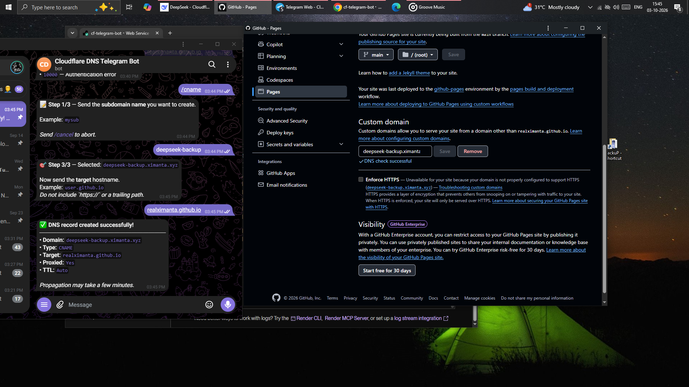

<div align="center">

<!-- Animated capsule banner -->


<!-- Animated typing banner -->
<a href="https://github.com/realximanta/cf-telegram-bot">
  
</a>


<!-- Badges (some are dynamic/animated) -->
<p>
  <a href="https://github.com/realximanta/cf-telegram-bot/stargazers">
    
  </a>
  <a href="https://github.com/realximanta/cf-telegram-bot/network/members">
    
  </a>
  <a href="https://github.com/realximanta/cf-telegram-bot/issues">
    
  </a>
  <a href="https://github.com/realximanta/cf-telegram-bot/blob/main/LICENSE">
    
  </a>
</p>

<p>
  
  
  
  
</p>

<!-- Animated divider -->


</div>

---

## ✨ What is this?

A **long-polling Telegram bot** that lets you create Cloudflare **CNAME** records from Telegram — no more opening the heavy Cloudflare dashboard on prepaid mobile data.

- 🎯 **Interactive flow** — inline buttons list every domain in your Cloudflare account
- 🔒 **Locked to you** — only whitelisted Telegram chat IDs can use it
- 💸 **Data-cheap** — a full DNS change uses **< 1 KB** vs **2–5 MB** on the web UI
- 🩺 **Self keep-alive** — ships a `/health` endpoint for Render + UptimeRobot
- 🧩 **Zero cost** — Render free tier + UptimeRobot free tier

---

## 🎬 Live Flow Preview

<div align="center">
  
</div>

<div align="center">

```text
You:  /cname
Bot:  📝 Step 1/3 — Send the subdomain name. Example: ximanta

You:  ximanta
Bot:  🌐 Step 2/3 — Pick the full domain for ximanta:
      [ ximanta.ximanta.xyz ]
      [ ximanta.ximanta.space ]
      [ ximanta.dev-ximanta.site ]
      [ ximanta.kaziranga.site ]
      [ ❌ Cancel ]

You:  (taps ximanta.ximanta.xyz)
Bot:  🎯 Step 3/3 — Selected: ximanta.ximanta.xyz
      Now send the target hostname. Example: realximanta.github.io

You:  realximanta.github.io
Bot:  ✅ DNS record created successfully!
      • Domain: ximanta.ximanta.xyz
      • Type:   CNAME
      • Target: realximanta.github.io
      • Proxied: Yes
      • TTL:     Auto
```

</div>

---

## 🚀 Quick Start

### Option A — Fork the repo (recommended)

1. Click the **Fork** button at the top-right of
   [github.com/realximanta/cf-telegram-bot](https://github.com/realximanta/cf-telegram-bot).
2. On your fork, click **Code → HTTPS** and copy the URL.
3. Continue to [Clone & run](#option-b--clone-the-repo).

### Option B — Clone the repo

```bash
# HTTPS
git clone https://github.com/realximanta/cf-telegram-bot.git

# SSH (if you have SSH keys configured)
git clone git@github.com:realximanta/cf-telegram-bot.git

# GitHub CLI
gh repo clone realximanta/cf-telegram-bot

# Clone into a specific folder
git clone https://github.com/realximanta/cf-telegram-bot.git my-dns-bot
cd my-dns-bot
```

Then:

```bash
python -m venv .venv
source .venv/bin/activate         # Windows: .venv\Scripts\activate
pip install -r requirements.txt
cp .env.example .env              # fill in your secrets
python bot.py
```

---

## 🛠️ Setup Guide

### 1. Create a Telegram bot

1. Message [@BotFather](https://t.me/BotFather) → `/newbot` → copy the token.
2. Message [@userinfobot](https://t.me/userinfobot) → copy your numeric ID.

### 2. Create a Cloudflare API token

1. Go to [Cloudflare API Tokens](https://dash.cloudflare.com/profile/api-tokens).
2. Click **Create Token → Edit zone DNS** template.
3. Permissions: `Zone → DNS → Edit` and `Zone → Zone → Read`.
4. Zone Resources: restrict to the specific zones you want the bot to touch.
5. Copy the token.

### 3. Deploy to Render (free)

1. Push the repo to your GitHub (fork already does this).
2. Go to [Render Dashboard](https://dashboard.render.com/) → **New → Blueprint**.
3. Select your repo — Render reads `render.yaml` automatically.
4. Fill the three secret env vars:
   - `TELEGRAM_TOKEN`
   - `CF_API_TOKEN`
   - `ALLOWED_CHAT_IDS` (your numeric Telegram ID)
5. Deploy. You'll get a URL like
   `https://cf-dns-telegram-bot.onrender.com`.

### 4. Keep it alive with UptimeRobot

Render's free tier sleeps after ~15 minutes of inactivity.

1. Sign up at [UptimeRobot](https://uptimerobot.com/).
2. **Add Monitor → HTTP(s)**.
3. URL: `https://<your-render-service>.onrender.com/health`
4. Interval: **5 minutes**.
5. Save. Your bot now stays awake 24/7.

---

## 📖 Commands

| Command   | Description                     |
| --------- | ------------------------------- |
| `/start`  | Show the help message           |
| `/help`   | Same as `/start`                |
| `/cname`  | Start the CNAME creation flow   |
| `/cancel` | Abort the current flow          |

---

## 🧱 Project Structure

```text
cf-telegram-bot/
├── bot.py               # Main bot + health server
├── requirements.txt     # Python dependencies
├── render.yaml          # Render Blueprint
├── .env.example         # Env template
├── .gitignore
└── README.md
```

---

## 🔐 Security

- The bot **only responds** to chat IDs listed in `ALLOWED_CHAT_IDS`.
- Scope your Cloudflare token to specific zones — never use a Global API Key.
- `.env` is ignored by git; secrets live only in Render's environment.

---

## 🧪 Local Development

```bash
git clone https://github.com/realximanta/cf-telegram-bot.git
cd cf-telegram-bot
python -m venv .venv && source .venv/bin/activate
pip install -r requirements.txt
cp .env.example .env
# edit .env with your TELEGRAM_TOKEN, CF_API_TOKEN, ALLOWED_CHAT_IDS
python bot.py
```

---

## 🗺️ Roadmap

- [x] `/cname` creation
- [ ] `/a`, `/aaaa`, `/txt`, `/mx` records
- [ ] `/list` records per zone
- [ ] `/delete` with confirmation
- [ ] Proxy toggle (orange cloud on/off)

PRs welcome — see [CONTRIBUTING](#-contributing).

---

## 🤝 Contributing

1. Fork the repo.
2. Create a feature branch: `git checkout -b feat/awesome-thing`.
3. Commit: `git commit -m "feat: add awesome thing"`.
4. Push: `git push origin feat/awesome-thing`.
5. Open a Pull Request.

---

## 📬 Contact

<div align="center">

**Author:** [@realximanta](https://github.com/realximanta) · **Email:** [realximanta@gmail.com](mailto:realximanta@gmail.com)

<a href="https://github.com/realximanta">
  
</a>
<a href="mailto:realximanta@gmail.com">
  
</a>

</div>

---

## 📄 License

Released under the **MIT License** — see [LICENSE](LICENSE) for details.

<div align="center">


</div>
